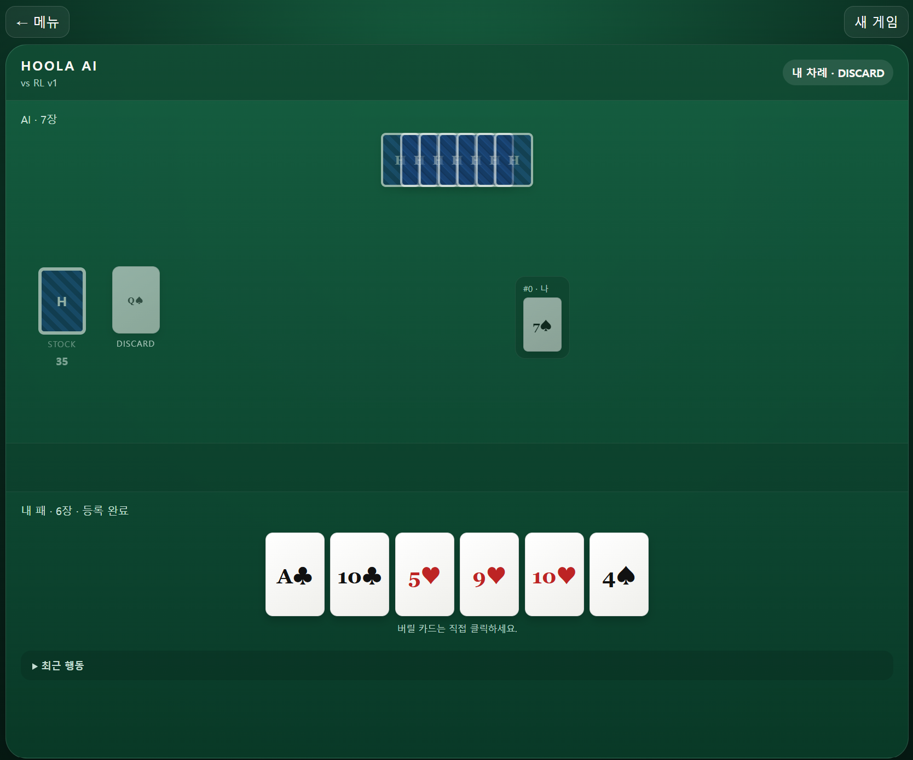

# Hoola AI v1.1

**Hoola AI** is a playable AI research project for **Hoola (훌라)**, a Korean rummy-style card game, featuring heuristic and reinforcement-learning agents.  
It is the first public game-AI project of the **Virtual Institute for Machine Learning (VIML)**.



*Web interface for playing Hoola against the trained reinforcement-learning agent.*

The repository contains:

- a deterministic two-player Hoola game engine,
- Human, Random, and Heuristic agents,
- a masked-PPO reinforcement-learning pipeline,
- training-data recorders and evaluation tools,
- a pretrained RL checkpoint,
- and a FastAPI + React web-game MVP.

> **Note on rules:** Hoola is played with several local and house-rule variations. This repository implements the specific two-player ruleset described below. The code, tests, and AI all use this ruleset consistently.

---

## What is Hoola?

Hoola is a Korean shedding / rummy-style card game played with a standard 52-card deck. Players try to get rid of all cards in their hand by forming valid **melds**, adding cards to melds already on the table, and discarding strategically.

This project currently models **two-player Hoola**.

### Objective

Be the first player to empty your hand.

A player wins immediately when the last card leaves the hand through a legal meld, layoff, Thank You action, or discard.

### Setup

- 2 players
- Standard 52-card deck, no jokers
- 7 cards are dealt to each player
- One card is placed face-up to start the discard pile
- The remaining cards form the stock
- Player 0 acts first

The initial face-up discard is not considered an opponent discard, so it cannot trigger a Thank You action on the first turn.

---

## Rules implemented in this project

### 1. Melds

A player may place cards on the table as one of the following melds.

#### Set

Three or four cards of the same rank.

Examples:

```text
7♣ 7♦ 7♥
Q♣ Q♦ Q♥ Q♠
```

#### Run

Three or more consecutive cards of the same suit.

Examples:

```text
4♠ 5♠ 6♠
10♥ J♥ Q♥ K♥
Q♣ K♣ A♣
K♦ A♦ 2♦
```

Ranks are treated cyclically for runs:

```text
A - 2 - ... - Q - K - A
```

so wrap-around runs such as `Q-K-A` and `K-A-2` are legal in this implementation.

#### Single Seven

A single `7` may be registered as a legal meld by itself.

```text
7♥
```

A singleton seven can later be extended with the adjacent card of the same suit (`6` or `8`), or can become a set of sevens when legally extended.

---

### 2. Turn flow

A normal turn has three phases:

```text
DRAW  ->  PLAY  ->  DISCARD
```

#### DRAW phase

A player can normally draw from the stock.

Under the rules used by this project, a player may instead act **before drawing** when a legal action is already available:

- register a new meld from the cards already in hand,
- lay off a card if the player has already registered,
- or use **Thank You** on the opponent's most recent discard.

#### PLAY phase

After drawing—or after another legal opening action—the player may:

- register one or more melds,
- lay cards off onto existing table melds,
- then stop playing cards and proceed to discard.

#### DISCARD phase

The player discards one card, then the turn passes to the opponent.

If the discard removes the final card from the player's hand, that player wins immediately.

---

### 3. Registration and layoff

Once a player has registered at least one meld, that player is considered **registered**.

A registered player may lay cards onto compatible melds already on the table, including an opponent's meld.

Examples include:

- extending a run,
- adding the fourth card to a three-card set,
- extending a singleton seven with the same-suit 6 or 8.

For RL, multi-card layoff sequences are represented as equivalent **atomic actions** so that the action vocabulary remains fixed and maskable.

---

### 4. Thank You (땡큐)

If the opponent's most recent discard completes a **new meld** with cards in the current player's hand, the player may take that discard immediately instead of drawing from the stock.

The discarded card must be part of the newly created meld.

Examples:

```text
Hand:     6♠ 7♠ ...
Opponent discards: 8♠
Result:   6♠ 7♠ 8♠
```

or

```text
Hand:     Q♣ Q♥ ...
Opponent discards: Q♦
Result:   Q♣ Q♥ Q♦
```

In this implementation:

- Thank You must create a **new meld**,
- the discarded card cannot be used only as a layoff onto an existing meld,
- and a discarded `7` alone does not qualify; at least two cards from the player's hand must combine with the discard.

---

### 5. Stock recycling and draws

If the stock becomes empty while more than one card remains in the discard pile, the older discarded cards are shuffled to form a new stock while the top discard remains visible.

Games are capped by `max_turns` (default: 500) to prevent pathological infinite games; reaching the cap produces a draw.

---

## Project status

Hoola AI v1.1 currently provides:

- deterministic game engine with seeded replay,
- rule validation and legal-action enumeration,
- Human agent,
- Random agent,
- Heuristic v1 agent,
- fixed RL action vocabulary with legal-action masking,
- 322-dimensional hidden-information-safe observations,
- masked PPO training,
- human / heuristic gameplay-record support,
- pretrained RL checkpoint,
- FastAPI backend,
- React web-game MVP,
- 70 automated tests.

---

## Pretrained checkpoint

A reference checkpoint is included at:

```text
checkpoints/best.pt
```

Checkpoint metadata:

```text
format              hoola-rl-v1
observation size    322
fixed action size   2400
hidden layers       256, 256
training update     2000
environment steps   7,329,626
training episodes   318,400
best eval win rate  0.49 vs Heuristic v1 during training evaluation
```

The reported evaluation value is training metadata, not a universal strength rating; results depend on seeds, opponent policy, seat assignment, and evaluation settings.

Evaluate the included checkpoint with:

```bash
python3 evaluate_rl.py checkpoints/best.pt \
    --games 1000 \
    --opponent heuristic
```

---

## Installation

Python 3.10+ is required.

For the core engine:

```bash
pip install -e .
```

For RL support:

```bash
pip install -e ".[rl]"
```

RL dependencies include NumPy, Gymnasium, and PyTorch.

---

## Quick start

### Human vs Heuristic v1

```bash
python run_game.py --p0 human --p1 heuristic --explain-ai public
```

If `--seed` is omitted, a new game seed is generated. Reproduce a game with:

```bash
python run_game.py --p0 human --p1 heuristic --seed 12345
```

### Human vs pretrained RL agent

```bash
python run_game.py \
    --p0 human \
    --p1 rl \
    --rl-checkpoint checkpoints/best.pt
```

or use:

```bash
./run_game_rl.sh
```

---

## Web MVP

The repository includes a FastAPI backend and React frontend.

### Backend

From the project root:

```bash
python3 -m pip install fastapi 'uvicorn[standard]' pydantic
export HOOLA_RL_CHECKPOINT="checkpoints/best.pt"
uvicorn web.backend.app:app --reload --host 127.0.0.1 --port 8000
```

On Windows PowerShell:

```powershell
$env:HOOLA_RL_CHECKPOINT="checkpoints/best.pt"
uvicorn web.backend.app:app --reload --host 127.0.0.1 --port 8000
```

API documentation:

```text
http://127.0.0.1:8000/docs
```

### Frontend

In a second terminal:

```bash
cd web/frontend
npm install
npm run dev
```

Then open:

```text
http://localhost:5173
```

The web MVP supports Human vs Heuristic and Human vs RL play, hidden opponent cards, table melds, action controls, game logs, and completed-game training records.

---

## AI observation

`encode_observation()` produces a 322-dimensional `float32` vector without leaking hidden information.

For each of the 52 cards, the encoder uses a six-way one-hot state:

1. unknown (stock or opponent hidden hand)
2. my hand
3. discard history
4. top discard
5. my public meld
6. opponent public meld

Global features include opponent hand size, stock/discard size, registration state, phase, and turn progress.

Opponent hidden cards and stock cards are both encoded as `unknown`.

---

## Fixed action vocabulary and legal-action masking

The RL action space is fixed at:

```text
Discrete(2400)
```

It covers:

- DRAW
- PASS
- 52 DISCARD actions
- all representable MELD actions
- all representable THANK YOU actions
- atomic LAYOFF actions for table-meld slots

At every decision point, only legal actions receive `action_mask == 1`.

This allows the policy to assign exactly zero probability to illegal actions.

---

## HoolaEnv

```python
from hoola.env import HoolaEnv
import numpy as np

env = HoolaEnv(opponent="heuristic", learning_player=0)
obs, info = env.reset()

while True:
    legal_ids = np.flatnonzero(obs["action_mask"])
    action_id = int(np.random.choice(legal_ids))
    obs, reward, terminated, truncated, info = env.step(action_id)
    if terminated or truncated:
        break
```

`HoolaEnv` exposes a single-learning-player Gymnasium-style API. The opponent can be `random`, `heuristic`, or a custom agent implementing `select_action()`.

Terminal reward from the learner's perspective:

```text
win   +1
loss  -1
draw   0
```

Smoke test:

```bash
python env_smoke_test.py
```

---

## RL v1: masked PPO

The current policy uses a small MLP actor-critic:

```text
322 observation features
        |
      256
        |
      256
      /   \
2400 policy  value(1)
```

A legal-action mask is applied to the 2400-dimensional policy output at every decision.

Because a Hoola turn can contain a variable number of micro-actions (`DRAW`, `MELD`, `LAYOFF`, `PASS`, `DISCARD`), RL v1 does not use intermediate shaping rewards. The main game outcome is:

```text
win  = +1
loss = -1
draw =  0
```

### Smoke training

```bash
python3 train_rl.py \
    --updates 10 \
    --episodes-per-update 16 \
    --eval-every 5 \
    --eval-games 100
```

### Example longer training

```bash
python3 train_rl.py \
    --updates 200 \
    --episodes-per-update 64 \
    --eval-every 10 \
    --eval-games 200
```

---

## Gameplay records

Save Human vs Heuristic training data:

```bash
python run_game.py \
    --p0 human \
    --p1 heuristic \
    --training-record records/human_vs_heuristic_001.npz
```

AI vs AI works the same way:

```bash
python run_game.py \
    --p0 heuristic \
    --p1 random \
    --quiet \
    --training-record records/heuristic_vs_random_001.npz
```

Each completed record produces:

- `*.npz` — learning tensors
- matching `*.json` — metadata such as seed, player type, phase, and final result

Major NPZ arrays:

- `observations`: `[N, 322]`, `float32`
- `action_masks`: `[N, 2400]`, `int8`
- `action_ids`: `[N]`, `int32`
- `acting_players`: `[N]`
- `final_outcomes`: `[N]`
- `terminal_rewards`: `[N]`
- `terminal_after_action`: `[N]`
- `turn_indices`: `[N]`

Inspect a record with:

```bash
python inspect_training_record.py records/human_vs_heuristic_001.npz
```

Numbered record files are automatically advanced instead of overwritten.

---

## Tests and benchmark

Run the test suite:

```bash
pytest -q
```

Current v1.1 test status:

```text
70 passed
```

Run an agent benchmark:

```bash
python benchmark_agents.py --games 1000 --seed 12345
```

An earlier v0.9 sanity benchmark of Heuristic v1 vs Random over 1000 alternating-seat games produced:

```text
Heuristic wins: 856
Random wins:    144
Draws:            0
Win rate:       85.6%
```

This is a sanity benchmark, not a claim of optimal Hoola play.

---

## Repository structure

```text
hoola-ai/
├── agents/                  # Human, Random, Heuristic agents
├── checkpoints/
│   └── best.pt              # included pretrained RL checkpoint
├── hoola/                   # game engine, rules, observations, action codec
├── rl/                      # actor-critic model and PPO utilities
├── tests/                   # automated tests
├── web/
│   ├── backend/             # FastAPI API
│   └── frontend/            # React/Vite client
├── benchmark_agents.py
├── evaluate_rl.py
├── run_game.py
├── train_rl.py
└── pyproject.toml
```

---

## Roadmap

Planned directions include:

- improve human-play data collection,
- stronger RL / self-play agents,
- richer AI evaluation and explainability,
- improved web-game UX,
- PWA / mobile packaging,
- ONNX or browser-side inference,
- public online play,
- and continued game-AI research under VIML.

---

## About VIML

The **Virtual Institute for Machine Learning (VIML)** is an independent project for building and studying machine-learning systems, game AI, scientific computing tools, and interactive AI applications.

Hoola AI is its first game-AI project.

## License

This project is licensed under the
**VIML Research and Non-Commercial License v1.0**.

Free for research, educational, and personal non-commercial use.
Commercial use requires separate permission from the copyright holder.

See [LICENSE](LICENSE) for full terms.
